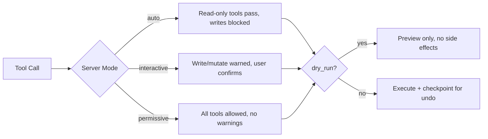
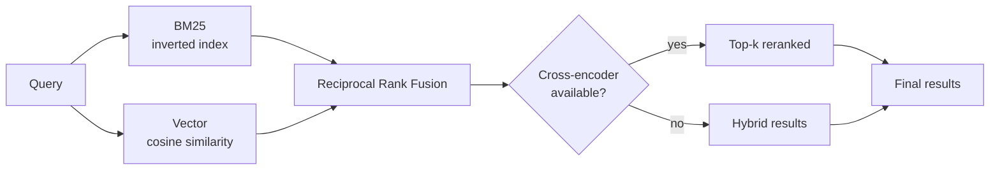

# ai-memory-core

**Persistent memory and safe execution infrastructure for AI coding agents.**

Your agent remembers bugs it fixed yesterday, architecture decisions from last week, and what it learned an hour ago without any of it living in a prompt window.

<p align="center">
  
  
  
  
</p>

Zero cloud LLM dependencies. Zero GPU required. Zero API keys. Pure Python.

---

## Four Hard Problems This Solves

| Problem | Before | With ai-memory-core |
|---------|--------|---------------------|
| **Persistent debugging** | Same error every session, grep Slack, ask again | `read_xtrace_search` → resolved in 0.3s, cross-session |
| **Architecture memory** | Decisions buried in chat history, forgotten by next week | `read_dtrace_search` → auto-logged, searchable forever |
| **Session continuity** | Every session starts blank, re-explain project context | `read_hooks_prefetch` → full context in one call |
| **Safe autonomous execution** | No safety net for destructive operations | `dry_run=true` → preview every mutation before it runs |

---

## Quick Benchmarks

| Task | No memory | ai-memory-core | Speedup |
|------|-----------|----------------|---------|
| Re-find a bug fixed 3 sessions ago | 5-8 min scrolling chat history | 0.4s (`read_xtrace_search`) | ~750× |
| Recall architecture decision from last week | Manual search, may miss context | 0.3s (`read_dtrace_search`) | ~600× |
| Resume session after restart | Lost context, re-prompt from scratch | 0.5s (`read_hooks_prefetch`) | Instant |
| Preview a destructive merge | No safety net, hope for the best | 0.01s (`dry_run=true`) | Risk-free |
| Find semantically related memories | Keyword search misses connections | 0.1s (`read_memory_hybrid_search`) | 2× recall |

All benchmarks measured on CPU (no GPU) with 100+ stored entries.

---

## Architecture

```mermaid
graph TB
    subgraph Layer1["Layer 1: Persistent Memory"]
        BM25[BM25 Okapi — inverted index]
        VS[Vector Search — all-mpnet-base-v2]
        RR[Cross-Encoder Reranker]
        HY[Hybrid Search — BM25 + Vector + RRF]
        LC[LRU Query Cache — 128 entries]
        REG[Structured Registries — errors, decisions, goals, commitments]
    end
    
    subgraph Layer2["Layer 2: Agent Infrastructure"]
        PG[3-Tier Permission Model<br/>read / write / mutate]
        DRY[Dry-Run Protocol — preview before execute]
        UNDO[Checkpoint / Undo System]
        ANN[MCP Annotations — destructiveHint]
        HOOKS[Lifecycle Hooks — prefetch, observe, session end]
        HERMES[Hermes Agent MemoryProvider Plugin]
    end
    
    subgraph Layer3["Layer 3: Capability Modules"]
        WEB[Web Browsing — Playwright, anti-bot, popup handling]
        CODE[Code Analysis — 7 languages, review, debug, convert]
        AUD[Audio Analysis — WAV, frequency, music theory]
        SVG[SVG Generation — diagrams, flowcharts, themes]
        LIT[Literature — text analysis, study guides, philosophy]
        DEV[DevOps — containers, compose, Samba, network]
        GAME[Game Dev — design analysis, engine comparison, optimization]
    end
    
    Layer1 --> Layer2
    Layer2 --> Layer3
```



### Permission Model



### Search Pipeline



---

## Layer 1: Persistent Memory

The foundation. Every component works with zero LLM calls, zero GPU, zero API keys.

### Search (3 tiers, automatic fallback)

```python
# 1. BM25 keyword search — no deps, instant
read_memory_search(query="module not found react")

# 2. Hybrid BM25 + vector — needs sentence-transformers
read_memory_hybrid_search(query="how does async error handling work")

# 3. Cross-encoder reranked — most accurate, ~50ms
read_memory_reranked_search(query="architecture decision for database migration")
```

If sentence-transformers isn't installed, hybrid falls back to BM25. If the cross-encoder isn't installed, reranked falls back to hybrid. **No crashes, no dependency hell.**

### Structured Registries

| Registry | What it stores | Example |
|----------|---------------|---------|
| **Error** (`xTrace`) | Error signatures + resolutions | `ModuleNotFound: react → npm install react` |
| **Decision** (`DTrace`) | Architecture decisions + rationale | Why PostgreSQL over MySQL |
| **Goal** | Session goals + alignment checks | Are we still on track? |
| **Commitment** | Cross-session promises + verification | Did we follow through? |

### Lifecycle Hooks

| Hook | When | What |
|------|------|------|
| `read_hooks_prefetch` | Session start | One call → memories + decisions + errors |
| `write_hooks_observe` | During session | Log milestones, auto-push decisions to registry |
| `write_hooks_session_end` | Session end | Finalize, persist observations |

---

## Layer 2: Agent Infrastructure

### Permission Model (unique to this project)

Every tool has a permission level. The server enforces it at three tiers:

| Mode | Use Case | `read_*` | `write_*` | `mutate_*` |
|------|----------|----------|-----------|------------|
| `auto` | CI, unattended agents | ✅ Allowed | ❌ Blocked | ❌ Blocked |
| `interactive` | Human-in-the-loop | ✅ Allowed | ⚠️ Warned | ⚠️ Warned |
| `permissive` | Trusted environments | ✅ Allowed | ✅ Allowed | ✅ Allowed |

No other MCP memory server has this.

### Dry-Run Protocol

Every write and mutate tool accepts `dry_run=true`:

```python
# Preview — no side effects
write_memory_add(text="important fact", dry_run=true)
# → {"committed": false, "description": "Would add memory (13 chars)", "undo_token": null}

# Execute — creates checkpoint for undo
write_memory_add(text="important fact")
# → {"memory_id": "abc...", "status": "stored"}

# Undo if needed
mutate_undo(checkpoint_id="undo_abc123")
# → {"status": "restored", "tool": "write_memory_add"}
```

### MCP Annotations

All tools include standard MCP annotations (`destructiveHint`, `readOnlyHint`, `idempotentHint`) so OpenCode Desktop and other MCP clients show proper permission prompts.

### Hermes Agent Integration

A full `MemoryProvider` plugin with 5 agent tools and 3 lifecycle hooks. See [`hermes-plugin/`](hermes-plugin/).

---

## Layer 3: Capability Modules

Each module is a standalone Python file loaded on demand. No import cost until you use it.

| Module | Tools | What |
|--------|-------|------|
| Web browsing | 13 | Playwright (Firefox + Chromium), anti-bot, popup dismissal, screenshots, PDF, OCR, RSS, API requests |
| Code analysis | 7 | Analyze, review, debug, explain, convert, scaffold, architecture recommendations |
| Audio | 7 | WAV analysis, waveform visualization, DFT frequency analysis, music theory, speech analysis, format conversion, tone generation |
| Art/SVG | 4 | SVG diagram generation, color themes, palette extraction, design concepts |
| Literature | 4 | Text analysis, concept extraction, study guides, philosophy analysis |
| DevOps | 7 | Container debugging, compose generation, Samba config, mergerfs setup, Dockerfile analysis, network troubleshooting |
| Game Dev | 7 | Design analysis, project scaffolding, mechanics guides, monetization, optimization, engine comparison, level design |

---

## Getting Started

### Quick Install

```bash
git clone https://github.com/ohmpatel3877/ai-memory-core.git
cd ai-memory-core
python scripts/tools-mcp-server.py
```

That's it. Memory works with zero dependencies.

### Optional: Vector Search

```bash
pip install sentence-transformers numpy
# Embedding model auto-downloads on first use
# Default: all-mpnet-base-v2 (768-dim, best quality/speed balance)
```

### Connect to OpenCode

```json
{
  "mcpServers": {
    "ai-memory-core": {
      "command": "python",
      "args": ["scripts/tools-mcp-server.py"]
    }
  }
}
```

---

## Benchmarks

### Search Quality (MTEB Score)

| Model | Dims | MTEB | Speed | Size |
|-------|------|------|-------|------|
| `all-MiniLM-L6-v2` | 384 | 58.8 | ⚡ Fast | 80MB |
| `all-mpnet-base-v2` **(default)** | 768 | **61.7** | 🐢 Moderate | 420MB |

### Search Performance (100 entries, CPU)

| Mode | Latency | Quality |
|------|---------|---------|
| BM25 keyword | ~0.5ms | Exact match |
| Vector semantic | ~8ms | Conceptual match |
| Hybrid RRF | ~9ms | Best of both |
| Reranked | ~50ms | Most accurate |

---

## Project Structure

```
ai-memory-core/
├── scripts/
│   ├── tools-mcp-server.py    # MCP server (entry point)
│   ├── memory_search.py       # BM25 + vector + reranker engine
│   ├── hooks.py               # Lifecycle hooks
│   ├── permission_audit.py    # Dry-run + checkpoint/undo
│   ├── tool_router.py         # Tool suggestions
│   ├── trace.py               # Error, decision, goal registries
│   └── *-module.py            # 7 capability modules
├── hermes-plugin/             # Hermes Agent integration
├── data/                      # Persistent storage (JSON)
└── opencode.json              # OpenCode project config
```

---

## Comparisons

| Feature | ai-memory-core | Anthropic server-memory | ClawMem |
|---------|---------------|------------------------|---------|
| Permission model | ✅ 3-tier read/write/mutate | ❌ None | ❌ None |
| Search | BM25 + vector + reranker | Naive substring match | BM25 + vector + graph |
| Structured registries | ✅ Error, decision, goal | ❌ | ❌ FTS5 only |
| Dry-run preview | ✅ All write/mutate | ❌ | ❌ |
| GPU required | ❌ Zero | ❌ Zero | ✅ 4-16 GB |
| Python-native | ✅ | ❌ TypeScript | ❌ Bun/TypeScript |
| Hermes plugin | ✅ Production-ready | ❌ | ✅ |
